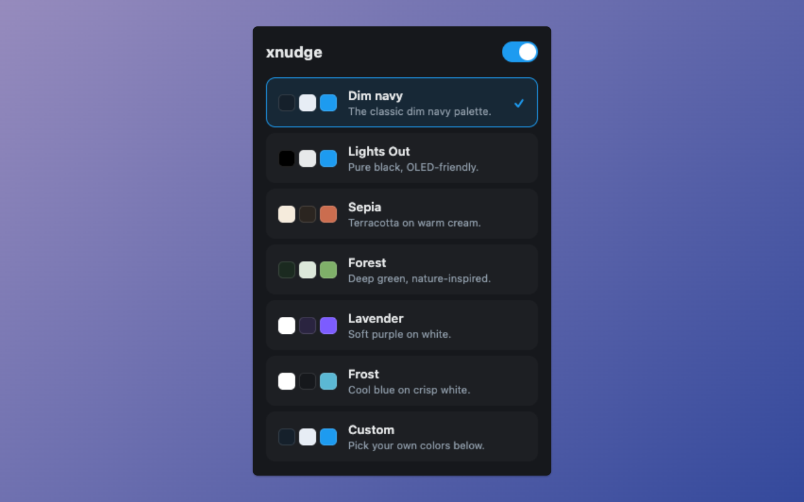

# xnudge

Chrome extension to nudge X (Twitter) into a more comfortable look.

[Install from the Chrome Web Store](https://chromewebstore.google.com/detail/xnudge/hjbnpdlgmndnlpnobpdpkaalblehbemg)



## What it does

- **Theme overrides** — repaint background, modals, borders, text, and links from a single curated palette.
- **Presets** — built-in palettes selectable from the popup, so you don't re-pick colors every time.
- **Custom palette** — pick your own colors when none of the presets fit.
- **Resilient to UI changes** — keeps working when X tweaks its layout, instead of breaking on every release.

## Development

```bash
npm install
npm run dev       # Vite dev server with HMR via @crxjs/vite-plugin
npm run build     # production build to dist/
npm run zip       # build and bundle dist/ into xnudge.zip for the Web Store
npm run typecheck
npm run lint
npm run format
```

### Loading the unpacked extension

1. Run `npm run build` (or `npm run dev`).
2. Open `chrome://extensions` and turn on **Developer mode**.
3. Click **Load unpacked** and select the `dist/` folder.

## License

TBD.
